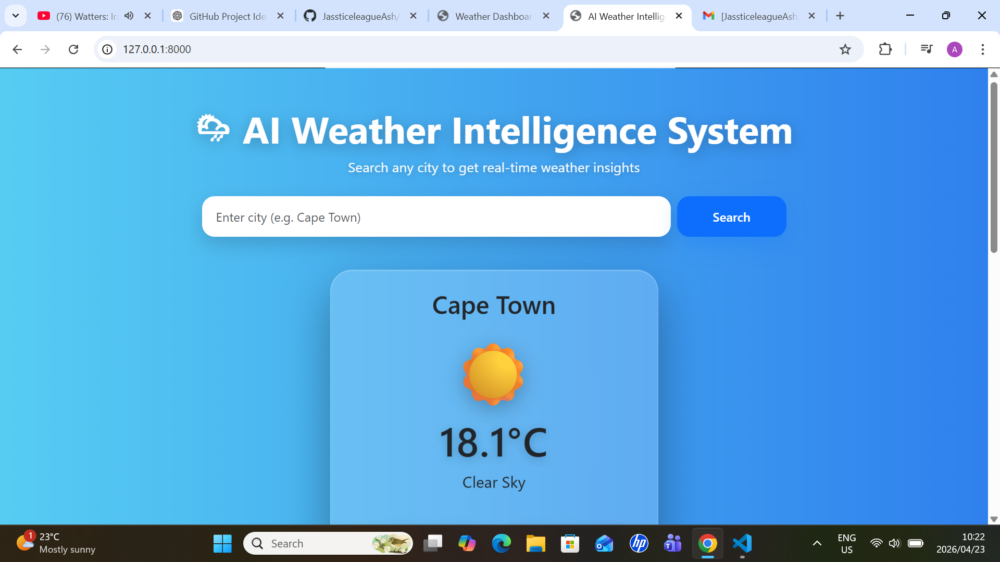
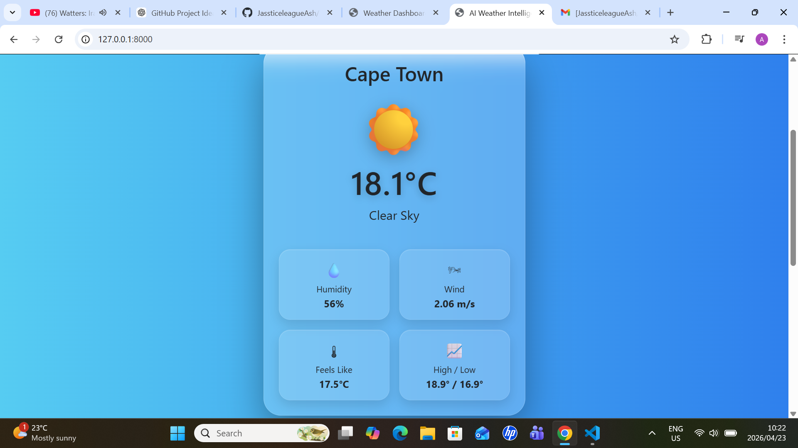
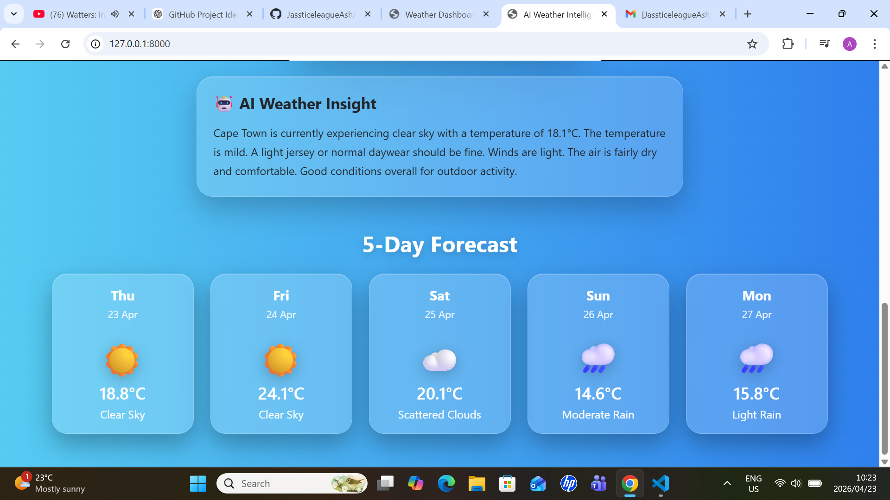
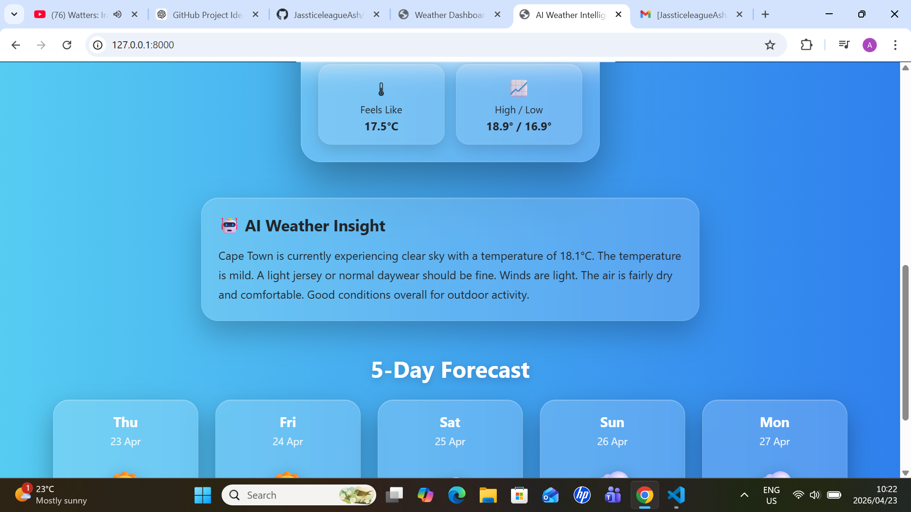

# AI Weather Intelligence System

## Overview

AI Weather Intelligence System is a modern, responsive web application that provides real-time weather data along with intelligent insights based on current conditions.

The application combines backend processing using Django with a clean, glassmorphism-inspired UI to deliver a user-friendly and visually engaging weather experience.

---

## Features

* Real-time weather data for any city worldwide
* AI-generated weather insights and recommendations
* Dynamic background that adapts to weather conditions
* 5-day forecast display with daily summaries
* Clean, mobile-responsive user interface
* Smart weather icons using emoji mapping
* Error handling for invalid city searches
* Smooth UI animations and transitions

---

## Tech Stack

* Backend: Django (Python)
* Frontend: HTML, CSS, Bootstrap
* API: OpenWeatherMap API
* Styling: Custom CSS (glassmorphism + gradients)

---

## Screenshots

### Main Interface



### Weather Card



### Forecast Section



### AI Insight



---

## Installation

### 1. Clone the repository

```bash
git clone https://github.com/YOUR_USERNAME/ai-weather-intelligence-system.git
cd ai-weather-intelligence-system
```

---

### 2. Create and activate virtual environment

```bash
python -m venv venv
venv\Scripts\activate   # Windows
```

---

### 3. Install dependencies

```bash
pip install -r requirements.txt
```

---

### 4. Add your API key

Create a `.env` file in the root directory:

```env
API_KEY=your_openweather_api_key
```

---

### 5. Run the server

```bash
python manage.py runserver
```

Then open:

```
http://127.0.0.1:8000/
```

---

## Project Structure

```
ai-weather-intelligence-system/
│
├── weather/
│   ├── views.py
│   ├── urls.py
│   ├── templates/
│   │   └── weather/
│   │       └── home.html
│
├── config/
│   ├── settings.py
│   ├── urls.py
│
├── requirements.txt
└── README.md
```

---

## Key Highlights

* Demonstrates API integration with real-world data
* Implements dynamic UI based on backend logic
* Uses clean, structured Django architecture
* Focus on both functionality and user experience

---

## Future Improvements

* Temperature unit toggle (Celsius/Fahrenheit)
* Geolocation-based weather detection
* Data visualisation (temperature charts)
* User favourites / saved cities
* Deployment to cloud platform (Render / Railway)

---


## 🌐 Live Demo
https://ai-weather-intelligence-system.onrender.com

## Author

Ashwin Jass
GitHub: https://github.com/JassticeleagueAsh
LinkedIn: https://www.linkedin.com/in/ashwin-jass-0aa4522aa/

---

## License

This project is for educational and portfolio purposes.
